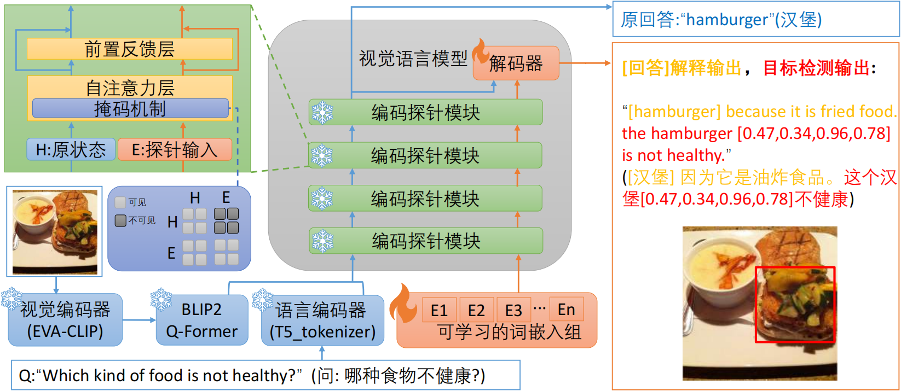
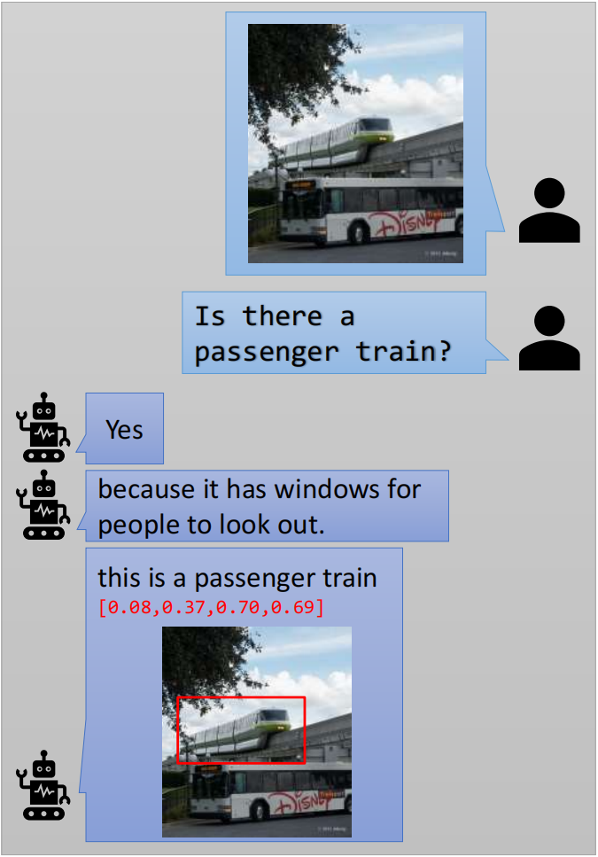

# SEM:Self-explanatory Method for Model Reasoning Process in Visual Question  Answering
## Introduction
SEM是一个针对自然语言解释任务的视觉语言模型，能够基于模型解决视觉问答任务时的推理过程生成忠实的自然语言解释，同时生成辅助解释的目标检测框。
<br>
    
<br>


## Install
我们的工作基于开源深度学习库[LAVIS](https://github.com/salesforce/LAVIS)，和预训练多模态模型[BLIP-2](https://github.com/salesforce/LAVIS/tree/main/projects/blip2)，请按照以下步骤进行环境配置：

1. 创建conda环境

```bash
conda create -n lavis_sem python=3.8
conda activate lavis_sem
```

2. 从源代码构建环境
```bash
git clone https://github.com/LouisJacky/LAVIS_SEM
cd LAVIS_SEM
pip install -e .
```

3. 创建用于评分的conda环境
```bash
conda create -n score python=3.8
conda activate score
pip install -r requirements_score.txt
```

## Dataset
### annotation
1. 请从[本链接](https://drive.google.com/drive/folders/1RvuxnmcMbPQUUfqJodzWo8J2ZtDZH89A?usp=drive_link)下载所需数据集的标注json文件，并保存在SEM/Datasets/annotation/路径下
其中pseudo_label_dataset.json是我们构建的伪标签数据集，复现本工作的性能比较实验需要以下文件：
- pseudo_label_dataset.json
- VQA-X_train.json
- VQA-X_val.json
- VQA-X_test.json
- vqaX_test.json
- vqaX_test_annot_exp.json

2. 将LAVIS_SEM/lavis/config/datasets/路径下的aok_vqa_sem.yaml、gqa_sem.yaml、gqa_vqax.yaml、vqa_x_sem.yaml、vqa_x_sem_eval.yaml文件中的"/path_to_your/SEM/"字符串改为你实际的SEM文件存储路径。

### image
本工作的性能比较实验需要以下数据集：
- 请下载[COCO_train_2014](http://images.cocodataset.org/zips/train2014.zip)数据集图像，将其中的图像移动到SEM/Datasets/images/VQA_X_train_images/路径下
- 请下载[COCO_val_2014](http://images.cocodataset.org/zips/val2014.zip)数据集图像，将其中的图像移动到SEM/Datasets/images/VQA_X_val_images/路径下
- 请下载[GQA](https://downloads.cs.stanford.edu/nlp/data/gqa/images.zip)数据集图像，将其中的图像移动到SEM/Datasets/images/GQA_train_images/路径下

对比实验还需要以下数据集：
- 请下载[COCO_train_2017](http://images.cocodataset.org/zips/train2017.zip)数据集图像，将其中的图像移动到SEM/Datasets/images/AOK_VQA_train_images/路径下

## Train
1. 请在lavis/projects/blip2/train/sem_train.yaml文件中设置训练参数，例如：

```yaml
#性能比较实验中，使用伪标签数据集的设置
model:  
  arch: blip2_t5_sem  
  model_type: pretrain_flant5xl  
  load_pretrained: True  
  
  pretrained: "https://storage.googleapis.com/sfr-vision-language-research/LAVIS/models/BLIP2/blip2_pretrained.pth"  
  max_txt_len: 80  
  find_unused_parameters: True  
  freeze_vit: True  
  
datasets:  
  gqa_vqax: # this is the pseudo_label_dataset we built  
  vis_processor:  
      train:  
        name: "blip_image_eval"  
  image_size: 224  
      eval:  
        name: "blip_image_eval"  
  image_size: 224  
    text_processor:  
      train:  
        name: "blip_question"  
  eval:  
        name: "blip_question"  
  build_info:  
      images:  
        storage: '/path_to_your/SEM/Datasets/images/'  
  
  
run:  
  task: vqa_bbox  
  # optimizer  
  lr_sched: "linear_warmup_cosine_lr"  
  init_lr: 1e-5  
  min_lr: 1e-6  
  warmup_lr: 1e-6  
  weight_decay: 0.05  
  max_epoch: 2  
  batch_size_train: 8  
  batch_size_eval: 8  
  num_workers: 4  
  warmup_steps: 2000  
  seed: 42  
  output_dir: "output/SEM/finetuned"  
  
  amp: False  
  resume_ckpt_path: null  
  evaluate: False  
  train_splits: ["train"]  
  valid_splits: ["val"] 
  
  device: "cuda"  
  world_size: 1  
  dist_url: "env://"  
  distributed: True
```
```yaml
#性能比较实验中，不使用伪标签数据集需要修改：
model:  
  arch: blip2_t5_sem
  
datasets:  
  vqa_x_sem: 
  
run:  
  max_epoch: 3
```
```yaml
#消融实验中，不使用探针结构需要修改：
model:  
  arch: blip2_t5_r
```
详细的参数设置方法请参考说明文档docs/tutorial.configs.rst

2. 使用以下命令进行训练：
```bash
conda activate lavis_sem
python -m torch.distributed.run --nproc_per_node=1 train_sem.py
```

## Checkpoints
1. 训练结束后，在lavis/output/SEM/finetuned路径下将生成以项目id命名的文件夹，其中的checkpoint_best.pth文件保存了训练参数。请使用LAVIS_SEM/SEM/Processer文件夹中的merge.py程序将训练参数与预训练参数合并。注意修改其中的project_id、path_to_LAVIS_SEM变量为你的实际路径。
<a id="section1"></a>
```python
project_id = "your_project_id" # eg: 20240509214  
path_to_LAVIS_SEM ="/path_to_your/LAVIS_SEM"  
```
```bash
python merge.py
```
2. 合并后的模型参数保存在SEM/Checkpoints文件夹下，你可以从[本链接]()下载我们在性能比较实验中训练得到的模型参数：
- merged_SEM_PseudoLabels.pth - 使用我们构建的伪标签数据集训练得到的模型参数
- merged_SEM_NoPseudoLabels.pth -不使用伪标签数据集，只用VQA-X训练集训练得到的模型参数


## Evaluate
1. 请在LAVIS_SEM\lavis\projects\blip2\eval\sem_eval.yaml文件中设置测试参数，将pretrained参数中的project_id和path_to_LAVIS_SEM替换为与[之前步骤](#section1)中相同的字符串。
```yaml
model:  
  arch: blip2_t5_sem  
  model_type: pretrain_flant5xl  
  use_grad_checkpoint: False  
  load_pretrained: True  
  
  pretrained: "{path_to_LAVIS_SEM}/SEM/Checkpoints/merged_{project_id}.pth"  
  
  evaluate: True  
  
datasets:  
  vqa_x_sem: # name of the dataset builder  
  type: eval  
    vis_processor:  
        eval:  
          name: "blip_image_eval"  
  image_size: 224  
    text_processor:  
        eval:  
          name: "blip_question"  
  
run:  
  task: vqa_bbox  
  # optimization-specific  
  batch_size_train: 16  
  batch_size_eval: 16  
  num_workers: 4  
  
  # inference-specific  
  max_len: 80  
  min_len: 1  
  num_beams: 5  
  inference_method: "generate"  
  prompt: "{}"  
  
  seed: 42  
  output_dir: "output/SEM/eval"  
  
  evaluate: True  
  test_splits: ["test"]  
  
  # distribution-specific  
  device: "cuda"  
  world_size: 1  
  dist_url: "env://"  
  distributed: True
```
2. 请使用以下命令进行测试：
```bash
python -m torch.distributed.run --nproc_per_node=1 evaluate_sem.py
```
3. 测试结束后，将在LAVIS_SEM/lavis/output/SEM/eval/路径下将生成以project_id<a id="section2"></a>命名的文件夹，其中的/result/test_vqa_result_rank0.json文件保存了预测结果。

## Score
1. 请从[本链接](https://drive.google.com/drive/folders/1nya7F-055ExZcnwSUMuWB9gtMmQbAO2L?usp=drive_link)下载cococaption文件夹，将其放置在SEM/Processer/路径下。
2. 修改LAVIS_SEM\SEM\Processer\cococaption\pycocoevalcap\spice\spice.py文件中的CACHE_DIR变量为你的实际路径。
```python
CACHE_DIR = '/path_to_your/.cache'
```
3. 请使用LAVIS_SEM/SEM/Processer文件夹中的score.py程序进行评分。注意将其中的[project_id](#section2)、path_to_LAVIS_SEM变量替换为你的实际路径，并自定义一个后缀名tail_name。
```python
project_id = "your_project_id"  
tail_name = project_id+"_your_tail_name"  
path_to_LAVIS_SEM ="/path_to_your/LAVIS_SEM"
```
4. 请使用以下命令进行评分
```bash
conda activate score
python score.py
```
评分结果将保存在以下路径的json文件中：
```python
{path_to_LAVIS_SEM}/SEM/Results/save_scores_pathExp_{tail_name}.json
```

## Results
你可以从[本链接](https://drive.google.com/drive/folders/1WjVJ5OVXaNNto-RRl61RT4Y-58nzVSmo?usp=drive_link)下载我们在性能比较实验中得到的测试集预测结果和评分结果，其中correct_question_ids_blip2_t5.json保存了原解码器预测正确的样本id，你可以通过以下步骤进行验证：
1. 在LAVIS_SEM\lavis\projects\blip2\eval\sem_eval.yaml文件中设置测试参数：
```yaml
# 使用原BLIP2模型的解码器预测答案
model:  
  arch: blip2_t5_r
  
pretrained: "https://storage.googleapis.com/sfr-vision-language-research/LAVIS/models/BLIP2/blip2_pretrained.pth"  

datasets:  
  vqa_x_sem: 
```
2. 请使用以下命令进行测试：
```bash
python -m torch.distributed.run --nproc_per_node=1 evaluate_sem.py
```
测试结束后，将在LAVIS_SEM/lavis/output/SEM/eval/路径下将生成以project_id<a id="section3"></a>命名的文件夹，其中保存了原解码器的预测结果。

3. 请使用LAVIS_SEM/SEM/Processer文件夹中的res_select.py程序挑选出原解码器预测正确的样本id。注意将其中的的[project_id](#section3)、path_to_LAVIS_SEM变量替换为你的实际路径，并自定义一个后缀名tail_name。
```python
tail_name = "blip2_t5"  
project_id = "your_project_id"  
path_to_LAVIS_SEM ="/path_to_your/LAVIS_SEM"
```
4. 使用以下命令运行res_select.py程序，将挑选出预测正确的样本id并保存在/SEM/Results文件夹下的correct_question_ids_{tail_name}.json文件中，该文件将与我们提供的correct_question_ids_blip2_t5.json完全一致。
```bash
python res_select.py
```

## Contact us
如果您有任何问题、意见或建议，请随时通过 lavis_sem@outlook.com 与我们联系。

If you have any questions, comments or suggestions, please do not hesitate to contact us at lavis_sem@outlook.com.

## License
[BSD 3-Clause License](LICENSE.txt)
